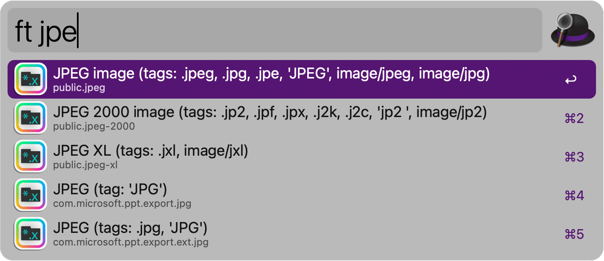

# File Type Search
[Alfred 5](https://www.alfredapp.com) workflow, which allows a filtered search for files of the selected file type.

## Usage
Search for a file type via the `ft` keyword. 

Press <kbd>↩</kbd> to select the file type.

Then search for a file with the set file type.

<kbd>↩</kbd>: Open the file.
<kbd>⌘</kbd>+<kbd>↩</kbd>: Reveal in Finder.

## Setup
1. Download [latest release](https://github.com/Pa7rickStar/File-Type-Search/releases/latest) of `File Type Search.alfredworkflow`.
2. Install into Alfred by double-click.
3. Enjoy ;-)

## Configuration

### Keyword:
The keyword used to tauch the worfklow.

### Interval for reloading system uti database: 
MacOS maintains a system wide database with [Uniform Type Identifier (UTI)](https://en.wikipedia.org/wiki/Uniform_Type_Identifier) like `public.jpeg`. Some UTI are managed by the system/ Apple, some are registered by installed software. When triggering the workflow with the keyword, all identifiers are loaded into Alfred. Since the process of getting the systems uti database is pretty slow, this workflow will create a json file with the necessary information when the workflow is used for the first time. When the json database is deleted or the `Interval for reloading system uti database` is passed, the workflow will create a new json file.

## Acknowledgements
This Workflow is heavily inspired by the [Simple Folder Search](https://alfred.app/workflows/alfredapp/simple-folder-search/) and [Dynamic File Search](https://alfred.app/workflows/alfredapp/dynamic-file-search/) respectively.
The workflow icon is also based on these workflows.

There is an example for creating a workflow which only searches *.pdf files in the [Alfred docs](https://www.alfredapp.com/help/workflows/inputs/file-filter/#workflow). However, the file type would be static then.

This workflow combines the both concepts so the file type can be set dynamically when using the workflow.

There is a similar [workflow](https://www.alfredforum.com/topic/20933-search-files-by-extension/) by [Stephen_C](https://github.com/Stephen-Lon), which lists all files with a given extension in a given folder. The files are not searchable though.

## TODO
- Find a way to select multiple file types before searching.
- Insert option to select a folder as search scope.
- Optimize database download.